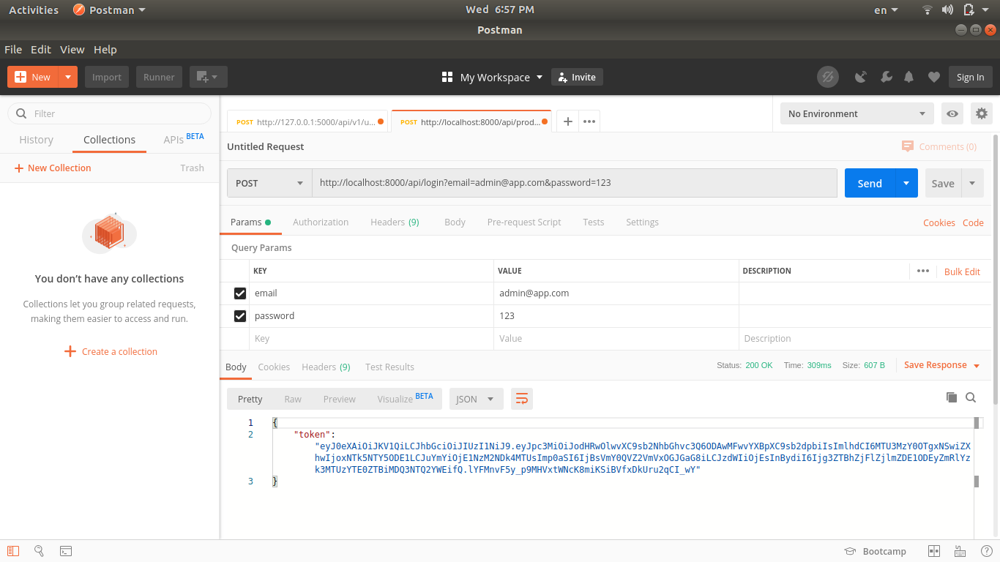

For creating REST API we use jwt token for stateless authentication. In this post I will show you how to add jwt to laravel for api authentication.


#### Laravel project setup
We can install laravel simply by composer command

```no-highlight
# composer create-project --prefer-dist laravel/laravel laravel-jwt
```

After laravel installetion we then move to jwt part. We will use the package [jwt-auth](https://github.com/tymondesigns/jwt-auth) in our project. We will use develop version to avoid issue.

```no-highlight
# composer require tymon/jwt-auth:dev-develop --prefer-source
```

In config/app.php add this to providers array

```php
...
Tymon\JWTAuth\Providers\LaravelServiceProvider::class,
```

Add the following facades to aliases array.

```php
'JWTAuth' => Tymon\JWTAuth\Facades\JWTAuth::class, 
'JWTFactory' => Tymon\JWTAuth\Facades\JWTFactory::class,
```

Run this command to publish JWT config file

```no-highlight
$ php artisan vendor:publish --provider="Tymon\JWTAuth\Providers\LaravelServiceProvider"
```

Then run this to generate secret key

```no-highlight
$ php artisan jwt:secret
```

After that we need to use Tymon\JWTAuth\Contracts\JWTSubject interface in our User model and implement methods getJWTIdentifier and getJWTCustomClaims.

```php
<?php

namespace App;

use Illuminate\Notifications\Notifiable;
use Illuminate\Contracts\Auth\MustVerifyEmail;
use Illuminate\Foundation\Auth\User as Authenticatable;
use Tymon\JWTAuth\Contracts\JWTSubject;

class User extends Authenticatable implements JWTSubject
{
    use Notifiable;

    /**
     * The attributes that are mass assignable.
     *
     * @var array
     */
    protected $fillable = [
        'name', 'email', 'password',
    ];

    /**
     * The attributes that should be hidden for arrays.
     *
     * @var array
     */
    protected $hidden = [
        'password', 'remember_token',
    ];

    public function getJWTIdentifier()
    {
        return $this->getKey();
    }

    public function getJWTCustomClaims()
    {
        return [];
    }


}
```

For authentication logic create UserController

```no-highlight
$ php artisan make:controller UserController
```
In UserController add this code

```php
<?php

namespace App\Http\Controllers;

use App\User;
use Illuminate\Http\Request;
use Illuminate\Support\Facades\Hash;
use Illuminate\Support\Facades\Validator;
use JWTAuth;
use Tymon\JWTAuth\Exceptions\JWTException;
use Tymon\JWTAuth\Exceptions\TokenExpiredException;
use Tymon\JWTAuth\Exceptions\TokenInvalidException;

class UserController extends Controller
{
    public function authenticate(Request $request)
    {
        $credentials = $request->only('email', 'password');

        try {
            if (!$token = JWTAuth::attempt($credentials)) {
                return response()->json(['error' => 'invalid_credentials'], 400);
            }
        } catch (JWTException $e) {
            return response()->json(['error' => 'could_not_create_token'], 500);
        }

        return response()->json(compact('token'));
    }


    public function register(Request $request)
    {
        $validator = Validator::make($request->all(), [
            'name' => 'required|string|max:255',
            'email' => 'required|string|email|max:255|unique:users',
            'password' => 'required|string|min:2|confirmed',
        ]);

        if ($validator->fails()) {
            return response()->json($validator->errors(), 400);
        }

        $user = User::create([
            'name' => $request->get('name'),
            'email' => $request->get('email'),
            'password' => Hash::make($request->get('password')),
        ]);

        $token = JWTAuth::fromUser($user);

        return response()->json(compact('user', 'token'), 201);
    }

    public function me()
    {
        return response()->json(auth()->user());
    }


    public function getAuthenticatedUser()
    {
        try {

            if (!$user = JWTAuth::parseToken()->authenticate()) {
                return response()->json(['user_not_found'], 404);
            }

        } catch ( TokenExpiredException $e) {

            return response()->json(['token_expired'], $e->getStatusCode());

        } catch ( TokenInvalidException $e) {

            return response()->json(['token_invalid'], $e->getStatusCode());

        } catch ( JWTException $e) {

            return response()->json(['token_absent'], $e->getStatusCode());

        }

        return response()->json(compact('user'));
    }


    public function logout()
    {
        JWTAuth::invalidate();
        return response([
            'status' => 'success',
            'msg' => 'Logged out Successfully.'
        ], 200);
    }

}
```

### Crete middleware and routes
We need to create a middleware to use token in authentication.

```no-highlight
$ php artisan make:middleware JwtMiddleware
```
In the app/Http/Middleware/JwtMiddleware file add this code

```php
<?php

namespace App\Http\Middleware;

use Closure;
use JWTAuth;
use Exception;
use Tymon\JWTAuth\Http\Middleware\BaseMiddleware;


class JwtMiddleware extends BaseMiddleware
{
    /**
     * Handle an incoming request.
     *
     * @param  \Illuminate\Http\Request  $request
     * @param  \Closure  $next
     * @return mixed
     */
    public function handle($request, Closure $next)
    {
        try {
            $user = JWTAuth::parseToken()->authenticate();
        } catch (Exception $e) {
            if ($e instanceof \Tymon\JWTAuth\Exceptions\TokenInvalidException){
                return response()->json(['status' => 'Token is Invalid']);
            }else if ($e instanceof \Tymon\JWTAuth\Exceptions\TokenExpiredException){
                return response()->json(['status' => 'Token is Expired']);
            }else{
                return response()->json(['status' => 'Authorization Token not found']);
            }
        }

        return $next($request);
    }
}
```

In app/http/Kernel.php we need to add middleware to `$routeMiddleware` array.

```php
protected $routeMiddleware = [
        ...,
        'jwt.verify' => \App\Http\Middleware\JwtMiddleware::class,
    ];
```

Now in routes/api.php file add this routes.
```php
Route::post('register', 'UserController@register');
Route::post('login', 'UserController@authenticate');

Route::group(['middleware' => ['jwt.verify']], function() {
    Route::get('user', 'UserController@getAuthenticatedUser');
});
```
Now our api authentication is ready. We can test it in our postman app.

If we create post request to login route with our credentials.


If we want to consume api from another application we have to configure CORS and we can do it easily by [barryvdh/laravel-cors](https://github.com/barryvdh/laravel-cors).